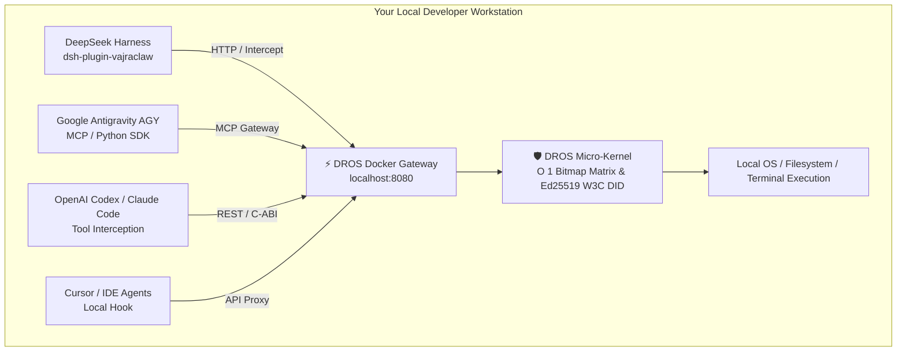

# ⚡ DROS™ VajraClaw for DSH & Multi-Agent Workstations
### Universal Deterministic Execution Governance, Circuit-Breaker & W3C DID Standard for Autonomous AI Agents

[](https://dr-os.io)
[](https://github.com/deepseek-ai/dsh)
[](https://www.npmjs.com/package/dsh-plugin-vajraclaw)
[](#)
[](#)

[English](#english) | [繁體中文說明](#-繁體中文說明) | [🌐 Official Website](https://dr-os.io)

Universal **Deterministic Runtime Execution Governance & Security Circuit-Breaker** Gateway. Natively integrates as a **DeepSeek Harness (DSH) plugin** while functioning as a centralized Docker-based security sidecar for **AGY (Google Antigravity), OpenAI Codex, Claude Code, Cursor, and OpenClaw**.

---

> 🎁 **【Community Edition: Free Forever for Personal Developers】**
> 
> We believe every developer's local workstation deserves enterprise-grade runtime protection.
> 
> * 🛡️ **100% Free for Personal Use** (Supports up to **5 Concurrent Agents** across your local workstation).
> * 🪪 **Native W3C DID Fingerprint (`RFC-010`)**: Automatically signs every tool invocation with decentralized cryptographic identity.
> * ⚡ **Universal Docker Gateway**: Protects DSH plugins, MCP servers, and external CLI agents simultaneously.

---

## 🏛️ Universal Multi-Agent Workstation Architecture

Although packaged as a DSH plugin for zero-friction setup, the underlying **DROS Gateway runs in Docker (`localhost:8080`)**, enabling you to protect your entire multi-agent environment under a single **5-Agent Concurrent Governance Envelope**:



---

## 💡 Defense-in-Depth Best Practices & Ecosystem Stacking

To achieve maximum defense-in-depth, we recommend combining DROS with open-source tools tailored to your workflow:

### Scenario 1: Pure DSH (DeepSeek Harness) Users
If you primarily operate within DSH, stack DROS with community governance plugins:
1. **DROS VajraClaw (`dsh-plugin-vajraclaw`)**: Operates at the bottom layer for **<1μs deterministic C-ABI tool fusing & prompt injection interception**.
2. **Open-Source DSH Security Plugins**: Add semantic prompt filters (e.g., NeMo/Llama-Guard plugins) to filter conversational toxicity before tool invocation.
3. **Network/Proxy Plugins**: Add local rate-limiting or firewall plugins to constrain upstream outbound bandwidth.

### Scenario 2: Heterogeneous Multi-Agent Users (DSH + AGY + Codex + Claude Code)
If you orchestrate multiple agents across different frameworks (similar to OpenShip / OpenClaw topologies):
1. **DROS Gateway as Core Anchor**: Let the DROS Docker container act as the central physical circuit-breaker and **W3C DID Identity Provider** across all agents.
2. **Unified MCP Governance**: Route all MCP (Model Context Protocol) tool servers through DROS Gateway before reaching your host filesystem.
3. **Open-Source Network & Sandbox Stacking**: Wrap the Docker gateway alongside local container sandboxes (e.g., Docker Desktop Sandbox / gVisor) to create a multi-tiered security defense covering Network, Process, and Agent Privilege.

---

## 📊 DROS Product Tiers & 6-Pillar Security Feature Matrix

| Feature / 6-Pillar Dimension | 🟢 Hacker / Community (Free) | 🔵 Startup | 🟣 Enterprise | 👑 Sovereign |
| :--- | :---: | :---: | :---: | :---: |
| **Target Audience** | **Individual Devs / Local Multi-Agent** | 10~50 Dev Teams | Enterprises / Listed Co. | Banking / Defense / Gov |
| **Price (USD)** | **100% Free** | **$799/yr** | **$7,990/yr (Base Fee)** | **Contact Sales** |
| **Machine UUID Limit** | **1 UUID** | 3 UUIDs | 15 UUIDs | **Unlimited** |
| **Concurrent Agents** | **5 Concurrent Agents** | 30 Agents | 450 Agents | **Unlimited (Swarm)** |
| **Pillar 1: Principal (W3C DID)** | ✅ **Native W3C `did:key`** | ✅ **3-Tier PKI DIT** | ✅ **Cross-Domain BEC Issuance** | ✅ Hardware Dongle |
| **Pillar 2: Authorization (Deterministic)**| ✅ **AST Bitmap Matching** | ✅ **Zero-Heap Bitmaps** | ✅ **Custom Capability Vector**| ✅ Multi-Dim Bitmap Matrix |
| **Pillar 3: Tool Bound (Syscall Gate)** | ✅ **C-ABI / HTTP Fuse (<1μs)**| ✅ **26.1μs In-Band Fuse** | ✅ **Sub-500ns Thread Panic**| ✅ Hardware Physical Fusing |
| **Pillar 4: Policy Gate (Dynamic Control)**| ❌ Static Rules Only | ✅ **Dynamic PII Masking** | ✅ **HITL Multi-Sig + ZKP** | ✅ Military Gate Matrix |
| **Pillar 5: Audit Log (Non-Repudiation)** | ✅ **Ed25519 Signed JSON** | ✅ **Ed25519 Signatures**| ✅ **SHA-256 Merkle Tree** | ✅ Court-Admissible Proof |
| **Pillar 6: Expiry/Revocation (<1μs)** | ❌ Gateway Restart | 🟡 15-min BEC Expiry | ✅ **<1μs RCU Pointer Swap** | ✅ Distributed Mesh Revoke |
| **RFC-010 Open Passport Standard** | ✅ **Full Local Issuance** | ✅ **Multi-Role DIT Sign** | ✅ **GuardVM Validation** | ✅ 3-Tier Sign Chain |
| **Add-On Compliance Packages** | ❌ Not Eligible | 💡 **Eligible for Add-Ons** | ⭐ **Eligible for Add-Ons** | ✅ Fully Included |
| **Deployment Target** | **Local PC / Multi-Agent Docker** | **VM / NAS Docker** | K8s / GKE / Cluster | Air-Gapped / FPGA |

---

## 🚀 Quick Start (30 Seconds)

### Step 1: Start the Universal DROS Docker Gateway
```bash
docker run -d -p 8080:8080 --name dros-gateway dros/hacker-gateway:v1.0.0
```

### Step 2: Connect Your Agents
* **For DSH**: Install the plugin:
  ```bash
  dsh plugin --profile web add dsh-plugin-vajraclaw
  ```
* **For AGY / Codex / Python SDK**:
  Set environment variable `DROS_GATEWAY_URL=http://localhost:8080` in your MCP or agent runtime.

---

## 🌐 Official Platform & Documentation
For interactive benchmarks, whitepapers, and enterprise architecture guides:
👉 **[https://dr-os.io](https://dr-os.io)**

---

## 🏛️ Official Organization & Contact Information
* **Company**: Top-Celestial Company Ltd. (康宸園有限公司)
* **Official Website**: [https://dr-os.io](https://dr-os.io)
* **Support & Inquiries**: [service@dr-os.io](mailto:service@dr-os.io)
* **GitHub Organization**: [https://github.com/Top-Celestial-Company-Ltd](https://github.com/Top-Celestial-Company-Ltd)

---

# 🇹🇼 繁體中文說明

通用型 **AI Agent 確定性運行期安全治理與微秒級熔斷微核心**。原生適配 **DeepSeek Harness (DSH)** 外掛，同時可作為 Docker 本地 Sidecar 守護 **AGY (Google Antigravity)、OpenAI Codex、Claude Code、Cursor 與 OpenClaw** 等各類 Agent。

---

> 🎁 **【個人開發者社群版：永久免費】**
> 
> 我們深信每位開發者的個人電腦都值得享有企業級的執行期防禦。
> 
> * 🛡️ **個人使用 100% 永久免費**（支援本機跨多個 Agent 累計最多 **5 個並發 Agent**）。
> * 🪪 **原生 W3C DID 密碼學指紋 (`RFC-010`)**：為每次 Tool 調用自動簽署去中心化身分，不可抵賴。
> * ⚡ **Universal Docker 網關**：同時保護 DSH 外掛、MCP 服務器與各類終端 CLI Agent。

---

## 🏛️ 通用多 Agent 混合工作站拓撲 (Multi-Agent Architecture)

DROS 雖然以 DSH 外掛形式提供極致便利的一鍵安裝，但其底層是 **標準化 Docker 容器 (`localhost:8080`)**。這意味著您可以將開發機上的所有 Agent 同時納入 DROS 統一治理：

* **DSH 使用者** ➔ 透過 `dsh-plugin-vajraclaw` 接入。
* **Google Antigravity (AGY)** ➔ 透過 MCP 網關或 Python SDK 接入。
* **OpenAI Codex / Claude Code / Cursor** ➔ 透過本地 REST API / Hook 攔截接入。
* **共用 5 並發上限** ➔ 單台開發機總共可同時守護 5 個活躍 Agent！

---

## 💡 防禦縱深最佳實踐與生態外掛堆疊指南

為了達成最極致的安全防禦，我們強烈建議根據您的使用情境，將 DROS 與各類開源工具進行「防禦縱深堆疊」：

### 情境 1：純 DSH (DeepSeek Harness) 深度玩家
若您主要在 DSH 環境中開發：
1. **底層：DROS VajraClaw (`dsh-plugin-vajraclaw`)** ➔ 負責最底層的 **<1μs 確定性 C-ABI 工具熔斷與提示注入實體阻斷**。
2. **語意層：搭配 DSH 開源資安外掛** ➔ 可搭配社群的語意審查外掛（如 NeMo / Llama-Guard 相關外掛）進行前期對話過濾。
3. **傳輸層：搭配網管/代理外掛** ➔ 設定對外流量限制，形成「語意過濾 ➔ DROS 物理熔斷 ➔ 網路邊界」三重防禦縱深。

### 情境 2：多 Agent 混合開發者 (DSH + AGY + Codex + Claude Code)
若您同時調度多個不同平台的 Agent（類似 OpenShip / OpenClaw 拓撲）：
1. **核心定錨：DROS Gateway 作為實體熔斷網關** ➔ 所有 Agent 共享 Docker 網關，統一由 DROS 派發 **W3C DID 指紋** 並實施工具權限點陣圖查表。
2. **MCP 集中化治理** ➔ 將本機所有 MCP 工具伺服器置於 DROS 之後，任何 Agent 呼叫終端或資料庫前必經 DROS 授權。
3. **開源網管與沙箱堆疊** ➔ 搭配本機 Docker 沙箱（如 gVisor / Docker Desktop Sandbox）與本機防火牆，構建涵蓋「身分 ➔ 權限 ➔ 執行熔斷 ➔ 容器隔離」的完整立體防禦縱深！

---

## 📊 DROS 官方產品階梯與 6-Pillar 安全防禦規格對照表

| 安全功能 / 6-Pillar 機制維度 | 🟢 Hacker / 個人社群版 (免費) | 🔵 Startup | 🟣 Enterprise | 👑 Sovereign |
| :--- | :---: | :---: | :---: | :---: |
| **目標客戶** | **個人開發者 / 本機多 Agent 玩家** | 10~50人新創團隊 | 中大型企業 / 上市公司 | 金融金控 / 國防 |
| **價格 (USD)** | **100% 永久免費** | **$799/年** | **$7,990/年 (基礎年約)** | **專案諮詢** |
| **機器授權 (UUIDs)** | **1 組 UUID** | 3 組 UUIDs | 15 組 UUIDs | **無限制** |
| **Concurrent Agents 上限** | **5 個並發 Agent** | 30 個 | 450 個 | **無限制 (Swarm)** |
| **Pillar 1：Principal 身份證明** | ✅ **原生 W3C `did:key` 指紋** | ✅ **3-Tier PKI DIT** | ✅ **跨域 BEC 憑證發放** | ✅ 硬體 Dongle 印記 |
| **Pillar 2：Authorization 權限區隔**| ✅ **AST 點陣圖比對** | ✅ **零堆積 Bitmaps** | ✅ **全自訂 Capability 向量**| ✅ 動態位元圖多維矩陣 |
| **Pillar 3：Tool Bound 工具邊界** | ✅ **C-ABI / HTTP 熔斷 (<1μs)** | ✅ **26.1μs 帶內熔斷** | ✅ **Sub-500ns Thread Panic**| ✅ 晶片硬體級物理熔斷 |
| **Pillar 4：Policy Gate 三大門閥** | ❌ 僅靜態規則 | ✅ **動態 PII 遮蔽** | ✅ **HITL 雙簽 + ZKP-Lite** | ✅ 軍規級門閥矩陣 |
| **Pillar 5：Audit Log 稽核追溯** | ✅ **Ed25519 簽章日誌** | ✅ **Ed25519 數位簽章**| ✅ **SHA-256 Merkle 雜湊鏈** | ✅ 不可否認性法院級憑證 |
| **Pillar 6：Expiry/Revocation 秒撤**| ❌ 需重啟 Gateway | 🟡 15分鐘 BEC 過期 | ✅ **<1μs RCU 原子指針切換** | ✅ 分散式秒級網格撤銷 |
| **RFC-010 開放 Agent 護照格式** | ✅ **本地完整簽章發行** | ✅ **多角色 DIT 簽署** | ✅ **企業 GuardVM 集中驗證** | ✅ 國防級 3-Tier 簽章鏈 |
| **開放彈性加購產業合規 Package** | ❌ 不開放加購 | 💡 **開放彈性加購** | ⭐ **開放彈性加購** | ✅ 包含完整權限 |
| **部署載體** | **Local PC / 多 Agent Docker 網關**| **VM / NAS Docker** | K8s / GKE / Cluster | Air-Gapped / FPGA |

---

## 🚀 30 秒極速上手

### 步驟 1：啟動 DROS Docker 網關
```bash
docker run -d -p 8080:8080 --name dros-gateway dros/hacker-gateway:v1.0.0
```

### 步驟 2：連接您的 Agent
* **DSH 使用者**：安裝外掛即可自動連線：
  ```bash
  dsh plugin --profile web add dsh-plugin-vajraclaw
  ```
* **AGY / Codex / Python SDK 使用者**：
  設定環境變數 `DROS_GATEWAY_URL=http://localhost:8080` 即可受 DROS 守護。

---

## 🏛️ 官方發行組織與聯繫資訊 (Official Contact)
* **發行主體**：Top-Celestial Company Ltd. (康宸園有限公司)
* **官方網站**：[https://dr-os.io](https://dr-os.io)
* **客戶服務與商務諮詢**：[service@dr-os.io](mailto:service@dr-os.io)
* **GitHub 官方組織**：[https://github.com/Top-Celestial-Company-Ltd](https://github.com/Top-Celestial-Company-Ltd)

---

## 📄 專利與法律聲明
**專利聲明：** DROS 執行治理與安全技術已申請美國臨時專利保護（U.S. Provisional Patent Application No. 64/111,973，Patent Pending）。
