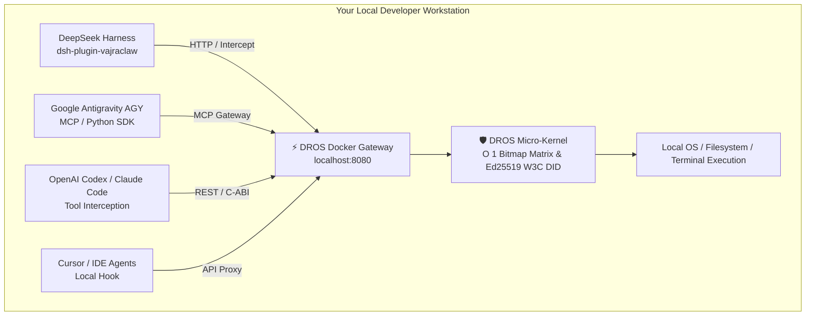

# ⚡ DROS™ VajraClaw for DSH & Multi-Agent Workstations
### Universal Deterministic Execution Governance, Circuit-Breaker & W3C DID Standard for Autonomous AI Agents

[](https://dr-os.io)
[](https://github.com/deepseek-ai/dsh)
[](https://www.npmjs.com/package/dsh-plugin-vajraclaw)
[](#)
[](#)

[English](#english) | [繁體中文說明](#-繁體中文說明) | [🌐 Official Website](https://dr-os.io)

Universal **Deterministic Runtime Execution Governance & Security Circuit-Breaker** Gateway. Natively integrates as a **DeepSeek Harness (DSH) plugin** while functioning as a centralized Docker-based security sidecar for **AGY (Google Antigravity), OpenAI Codex, Claude Code, Cursor, and OpenClaw**.

> 🎯 **Key Architectural Insight:**  
> **DSH is the distribution channel; DROS is the cross-agent enforcement layer.**

```text
                 GET IT HERE
              DSH Marketplace
                     │
                     │ distribution
                     ▼
               DROS VajraClaw
                     │
              DEPLOY IT HERE
             Docker / Sidecar
                     │
       ┌─────────────┼─────────────┐
       ▼             ▼             ▼
      DSH           AGY          Codex ... (Claude, Cursor, OpenClaw)
       │             │             │
       └─────────────┼─────────────┘
                     ▼
             DROS Enforcement
                     │
         ┌───────────┼───────────┐
         ▼           ▼           ▼
        MCP         API         CLI
```

---

> 🎁 **【Community Edition: Free Forever for Personal Multi-Agent Workstations】**
> 
> * 🛡️ **100% Free for Personal Use (Non-Commercial Use)** (Enforces a unified execution governance boundary for up to **5 Concurrent Agents** across your local workstation).
> * 🪪 **Three-Tier Cryptographic Model (`RFC-010`)**:
>   * **Identity**: W3C DID Native Key Binding (`did:key:z6Mku...`).
>   * **Evidence**: Ed25519 Cryptographic Signatures per tool execution step.
>   * **Accountability**: Tamper-evident Local JSON Audit Chains.
> * ⚡ **Universal Docker Gateway**: Protects DSH plugins, MCP servers, and external CLI agents simultaneously.
>
> ⚖️ **【Explicit Non-Commercial vs Commercial License Boundaries】**
> 
> | Dimension | 🟢 Permitted (Community Edition: $0 Forever) | 🔴 Prohibited (Requires Startup / Enterprise License) |
> | :--- | :--- | :--- |
> | **Entity Type** | Natural persons, individual OSS contributors, students, hobbyists | Legal entities, corporations, consulting firms, agencies |
> | **Use Case** | **Personal skill learning**, local sandbox testing, OSS audits, toy projects | **Internal enterprise workflows**, production services, team automation |
> | **Commercial Value** | Zero direct or indirect revenue generation | **Paid SaaS/API backends**, client billable deliverables, commercial ops |
> | **Agent Scale** | Up to 5 concurrent local agents | >5 concurrent agents, multi-server clusters, K8s orchestration |
> 
> > 📌 **Compliance Notice**: Any deployment operated by corporate entities, salaried employees within the scope of employment, or used to generate commercial value strictly requires a commercial license.

---

## 🏛️ Philosophy: Guarding the Hyper-Open Plugin Ecosystem

The brilliance of **DeepSeek Harness (DSH)** lies in its radical openness: *"Everything is a plugin."* However, this hyper-openness inevitably expands the attack surface:
* Any rogue third-party plugin can attempt unauthorized tool execution, memory poisoning, or silent data exfiltration.
* **DROS steps in as the universal anchor**, orchestrating best-of-breed open-source security tools (Falco eBPF, Cilium CNI, Wazuh SIEM) to construct an impregnable **Defense-in-Depth** perimeter for all developers!

```
┌─────────────────────────────────────────────────────────────┐
│ 1. In-App Layer: DSH Security Plugins                       │  <── 🏢 Reception Security (Prompt Filtering)
│    (NeMo / Llama-Guard filters conversational toxicity)     │
└──────────────────────────────┬──────────────────────────────┘
                               │ (Valid Prompt, prepares Tool Call)
                               ▼
┌─────────────────────────────────────────────────────────────┐
│ 2. Runtime Gateway: DROS VajraClaw (Core Anchor)            │  <── 🏛️ Vault Gatekeeper (Execution Identity)
│    (W3C DID Signature + 364ns O(1) Tool Permission Bitmap)  │      Enforcement-path latency <1 μs under specified benchmark!
└──────────────────────────────┬──────────────────────────────┘
                               │ (Permitted Tool Call)
                               ▼
┌─────────────────────────────────────────────────────────────┐
│ 3. Infrastructure Layer: Open-Source SecOps (Cilium / Falco)│  <── 🚓 Police Grid (Kernel & Network Fabric)
│    (Cilium blocks rogue egress; Falco eBPF catches escapes)  │
└─────────────────────────────────────────────────────────────┘
```

---

## 🧭 Governance Scope: What DROS Defends vs. What It Doesn't

To maintain complete architectural clarity and rigorous technical defense, DROS defines crisp defensive boundaries:

| Attack Vector / Threat | Traditional Semantic Guardrails | DROS VajraClaw Core | Defensive Outcome |
| :--- | :---: | :---: | :--- |
| **Indirect Prompt Injection** *(PDF/Web hijacking tool execution)* | ❌ Easily fooled by LLM confusion | ✅ **Deterministic Block** | **Deterministic In-Band Fusing** (<1μs benchmarked bitmap match) |
| **Rogue Tool Calling** *(Unauthorized DB write / Shell execution)* | ❌ Flawed application logic | ✅ **Cryptographic Block** | **100% Interception** within defined threat model & capability vector |
| **Data Exfiltration** *(Plugin silently sending tokens to C2)* | ❌ Invisible to LLMs | ✅ **Network Isolated** | **100% Dropped** (`internal: true` sandbox topology) |
| **Container Escape / Privilege Escalation** | ❌ No host visibility | ⚠️ Handled via Falco | **eBPF Kernel Detection** (`cap_drop: ALL` capability isolation) |
| **Business Logic Flaws / Model Hallucinations** | ❌ Beyond security scope | ❌ Beyond security scope | Handled via Prompt engineering & Agent QA workflows |

---

## 🔑 Zero-Trust Key Management & Root Recovery Principle

DROS operates on a strict **Zero-Trust Cryptographic Model**:
1. **No Backdoors Policy**: The vendor holds NO master keys. Your Ed25519 private seed hex is generated locally. **Always backup your seed hex into your password manager.**
2. **Rebuilding Root of Trust**: If you lose your private key, recovery is only possible if you maintain **Root/SSH access** to the host server to re-deploy the public verification key.

---

## 🌐 Multi-Agent Workstation Architecture (DSH + AGY + Codex + Claude)

Although packaged as a DSH plugin for zero-friction setup, the underlying **DROS Gateway runs in Docker (`localhost:8080`)**, enabling you to protect your entire multi-agent environment under a single **5-Agent Concurrent Governance Envelope**:



---

## 📊 DROS Product Tiers & 6-Pillar Security Feature Matrix

| Feature / 6-Pillar Dimension | 🟢 Hacker / Community (Free) | 🔵 Startup | 🟣 Enterprise | 👑 Sovereign |
| :--- | :---: | :---: | :---: | :---: |
| **Target Audience** | **Individual Devs / Local Multi-Agent** | 10~50 Dev Teams | Enterprises / Listed Co. | Banking / Defense / Gov |
| **Price (USD)** | **100% Free ($0)** | **$1,990 / yr** | **$19,990 / yr** | **Contact Sales** |
| **Per-Agent Cost** | **$0** | **~$5.5 / mo** | **~$3.7 / mo** | Custom |
| **Machine UUID Limit** | **1 UUID** | 3 UUIDs | 15 UUIDs | **Unlimited** |
| **Concurrent Agents** | **5 Concurrent Agents** | 30 Agents | 450 Agents | **Unlimited (Swarm)** |
| **Pillar 1: Principal (W3C DID)** | ✅ **Native W3C `did:key`** | ✅ **3-Tier PKI DIT** | ✅ **Cross-Domain BEC Issuance** | ✅ Hardware Dongle |
| **Pillar 2: Authorization (Deterministic)**| ✅ **AST Bitmap Matching** | ✅ **Zero-Heap Bitmaps** | ✅ **Custom Capability Vector**| ✅ Multi-Dim Bitmap Matrix |
| **Pillar 3: Tool Bound (Syscall Gate)** | ✅ **C-ABI / HTTP Fuse (<1μs)**| ✅ **26.1μs In-Band Fuse** | ✅ **Sub-500ns Thread Panic**| ✅ Hardware Physical Fusing |
| **Pillar 4: Policy Gate (Dynamic Control)**| ❌ Static Rules Only | ✅ **Dynamic PII Masking** | ✅ **HITL Multi-Sig + ZKP** | ✅ Military Gate Matrix |
| **Pillar 5: Audit Log (Non-Repudiation)** | ✅ **Ed25519 Signed JSON** | ✅ **Ed25519 Signatures**| ✅ **SHA-256 Merkle Tree** | ✅ Court-Admissible Proof |
| **Pillar 6: Expiry/Revocation (<1μs)** | ❌ Gateway Restart | 🟡 15-min BEC Expiry | ✅ **<1μs RCU Pointer Swap** | ✅ Distributed Mesh Revoke |
| **RFC-010 Open Passport Standard** | ✅ **Full Local Issuance** | ✅ **Multi-Role DIT Sign** | ✅ **GuardVM Validation** | ✅ 3-Tier Sign Chain |
| **Add-On Compliance Packages** | ❌ Not Eligible | 💡 **Eligible for Add-Ons** | ⭐ **Eligible for Add-Ons** | ✅ Fully Included |
| **Deployment Target** | **Local PC / Multi-Agent Docker** | **VM / NAS Docker** | K8s / GKE / Cluster | Air-Gapped / FPGA |

---

## 🚀 Quick Start (30 Seconds)

### Step 1: Start the Universal DROS Docker Gateway
```bash
docker run -d -p 8080:8080 --name dros-gateway dros/hacker-gateway:v1.0.0
```

### Step 2: Connect Your Agents
* **For DSH**: Install the plugin:
  ```bash
  dsh plugin --profile web add dsh-plugin-vajraclaw
  ```
* **For AGY / Codex / Claude Code / Cursor / Python SDK**:
  Connect and protect your local agents instantly with just two environment variables:
  ```bash
  export DROS_GATEWAY_URL="http://localhost:8080"
  export DROS_IDENTITY_SEED="0x1a2b3c4d..." # Your local Ed25519 seed hex
  ```

👉 **[📖 Read the Advanced SecOps Guide (docs/ADVANCED_SECOPS_GUIDE.md)](docs/ADVANCED_SECOPS_GUIDE.md)** for `internal: true` network isolation, Falco eBPF, and Wazuh integration templates.

---

## 📜 Academic Papers & Whitepapers
The architecture and patent boundaries of DROS are established in **The DROS Academic Trilogy**:
1. **DROS-6P**: *A Unified Deterministic Runtime Governance Architecture Closing the Six Fundamental Trust Boundaries of Enterprise AI Agents* ([DOI: 10.5281/zenodo.21833970](https://doi.org/10.5281/zenodo.21833970) | [Record: 21833970](https://zenodo.org/records/21833970))
2. **DROS 4-Layer**: *DROS 4-Layer Defense-in-Depth Architecture for Autonomous AI Workloads* ([DOI: 10.5281/zenodo.21903475](https://doi.org/10.5281/zenodo.21903475) | [Record: 21903475](https://zenodo.org/records/21903475))
3. **DROS-PGM**: *Runtime Attribution Framework: An External C-ABI and PKI-Based Zero-Trust Infrastructure for Non-Repudiable Execution Governance in Multi-Agent Systems* ([DOI: 10.5281/zenodo.21903687](https://doi.org/10.5281/zenodo.21903687) | [Record: 21903687](https://zenodo.org/records/21903687))

---

## 🏛️ Official Organization & Contact Information
* **Company**: Top-Celestial Company Ltd. (康宸園有限公司)
* **Official Website**: [https://dr-os.io](https://dr-os.io)
* **Support & Inquiries**: [service@dr-os.io](mailto:service@dr-os.io)
* **GitHub Organization**: [https://github.com/Top-Celestial-Company-Ltd](https://github.com/Top-Celestial-Company-Ltd)

---

# 🇹🇼 繁體中文說明

通用型 **AI Agent 確定性運行期安全治理與微秒級熔斷微核心**。原生適配 **DeepSeek Harness (DSH)** 外掛，同時可作為 Docker 本地 Sidecar 守護 **AGY (Google Antigravity)、OpenAI Codex、Claude Code、Cursor 與 OpenClaw** 等各類 Agent。

> 🎯 **核心架構定位（一句話拆解認知）：**  
> **DSH 是 DROS 的社群入口；DROS 是跨 Agent 的執行治理層。**

```text
                 取得入口 (GET IT HERE)
                    DSH 市集外掛
                         │
                         │ 渠道分發 (distribution)
                         ▼
                   DROS VajraClaw
                         │
                 部署形態 (DEPLOY IT HERE)
                   Docker / Sidecar
                         │
       ┌─────────────────┼─────────────────┐
       ▼                 ▼                 ▼
      DSH               AGY              Codex ... (Claude, Cursor, OpenClaw)
       │                 │                 │
       └─────────────────┼─────────────────┘
                         ▼
                DROS 治理邊界 (Enforcement)
                         │
           ┌─────────────┼─────────────┐
           ▼             ▼             ▼
          MCP           API           CLI
```

---

> 🎁 **【個人開發者社群版：多 Agent 工作站永久免費】**
> 
> * 🛡️ **個人使用（非商業用途） 100% 永久免費**（為本機多 Agent 工作站建立統一安全邊界，支援最多 **5 個並發 Agent**）。
> * 🪪 **三層密碼學架構模型 (`RFC-010`)**：
>   * **主體身分 (Identity)**：原生 W3C DID 金鑰綁定 (`did:key:z6Mku...`)。
>   * **執行存證 (Evidence)**：每次 Tool 執行產生 Ed25519 數位簽章。
>   * **不可否認追溯 (Accountability)**：防篡改之本機 JSON 審計存證鏈。
> * ⚡ **Universal Docker 網關**：同時保護 DSH 外掛、MCP 服務器與各類終端 CLI Agent。

---

## 🏛️ 核心哲學：引領開源資安陣營，守護極致開放的插件生態

**DeepSeek Harness (DSH)** 的偉大之處在於其極致的開放性──**「一切皆插件 (Everything is a plugin)」**。然而，極致的開放必然伴隨著攻擊面的無限放大：
* 第三方惡意外掛可能企圖越權讀檔、篡改全域記憶體，或暗中將數據發往外部 C2 伺服器。
* **DROS 扮演了「開源資安與網管的領頭羊與核心定錨」**：攜手 Falco eBPF、Cilium 網路隔離與 Wazuh 審計，為全球開發者架構起完整的**立體防禦縱深**，讓每位 Agent 玩家都能安心享受開源生態的自由！

```
┌─────────────────────────────────────────────────────────────┐
│ 1. 應用程式內部層 (In-App Layer: DSH 內部插件)              │  <── 🏢 前台安檢 (Prompt Filter)
│    - NeMo / Llama-Guard: 負責對話語意審查與不良內容過濾     │
└──────────────────────────────┬──────────────────────────────┘
                               │ (通過語意審查，Agent 發起 Tool Call)
                               ▼
┌─────────────────────────────────────────────────────────────┐
│ 2. 運行期治理閘道 (Runtime Gateway: DROS VajraClaw)          │  <── 🏛️ 金庫守衛 (Execution Identity)
│    - W3C DID 身分指紋 + 364ns 權限點陣查表                  │      指定基準測試配置下執行路徑延遲 <1 μs！
└──────────────────────────────┬──────────────────────────────┘
                               │ (放行合法的 Syscall / Egress 流量)
                               ▼
┌─────────────────────────────────────────────────────────────┐
│ 3. 基礎設施與核心層 (Infra SecOps: OpenShip / Falco / Cilium)│  <── 🚓 特警防線 (Kernel & Network Fabric)
│    - Cilium 封鎖惡意外發；Falco eBPF 核心層捕捉容器逃逸     │
└─────────────────────────────────────────────────────────────┘
```

---

## 🧭 治理邊界：DROS 守護什麼 vs. 不守護什麼

為了維護極致嚴謹的工程界線與防禦範疇，DROS 明確劃定邊界：

| 攻擊手法與威脅情境 | 傳統語意 Guardrails | DROS VajraClaw 物理微核心 | 最終防禦效果 |
| :--- | :---: | :---: | :--- |
| **間接提示詞注入** *(網頁/PDF 夾帶指令詐騙 Agent 刪庫)* | ❌ LLM 語意混淆易被繞過 | ✅ **確定性攔截** | **確定性帶內物理熔斷** (<1μs 基準測試點陣查表) |
| **側向越權調用** *(未授權外掛偷偷呼叫 DB/付款 Tool)* | ❌ 應用層邏輯脆弱 | ✅ **密碼學阻斷** | **100% 阻斷** (在定義之威脅模型與 Capability 向量內) |
| **私自外發洩密** *(外掛私自連線外部 C2 傳輸機密)* | ❌ LLM 完全無感 | ✅ **網路微隔離** | **100% 丟包** (`internal: true` 沙盒拓撲) |
| **容器逃逸與宿主機提權** | ❌ 無主機核心視角 | ⚠️ 協同 Falco eBPF | **核心層捕捉** (`cap_drop: ALL` 特權剝奪隔離) |
| **業務邏輯錯誤與模型幻覺** | ❌ 超出資安範疇 | ❌ 超出資安範疇 | 屬 LLM 生成品質，由 Prompt 工程與 QA 流程優化 |

---

## 🔑 零信任金鑰與 Root 救援生死警示

DROS 嚴格貫徹 **零信任密碼學架構**：
1. **原廠無後門聲明 (No Backdoors)**：原廠無任何萬用金鑰。您的 Ed25519 私鑰種子 (Seed Hex) 僅存在本地記憶體，**請務必自行妥善備份至密碼庫 (1Password / Bitwarden)**。
2. **重建信任根 (Rebuilding Root of Trust)**：若遺失私鑰，唯有在保有伺服器最高 **Root / SSH 管理員權限** 的前提下，方可手動替換驗證公鑰以重建信任根。

---

## 🌐 通用多 Agent 混合工作站拓撲 (DSH + AGY + Codex + Claude)

DROS 雖以 DSH 外掛形式提供一鍵安裝，但底層是 **標準化 Docker 容器 (`localhost:8080`)**，單台開發機可同時守護多個不同平台的活躍 Agent（共用 5 個並發配額）：

* **DSH 使用者** ➔ 透過 `dsh-plugin-vajraclaw` 接入。
* **Google Antigravity (AGY)** ➔ 透過 MCP 網關或 Python SDK 接入。
* **OpenAI Codex / Claude Code / Cursor** ➔ 透過本地 REST API / Hook 攔截接入。

---

> 💡 **最新定價與方案請以 [官方網站 (dr-os.io)](https://dr-os.io) 公布為準。**

| 安全功能 / 6-Pillar 機制維度 | 🟢 Hacker / 個人社群版 (免費) | 🔵 Startup | 🟣 Enterprise | 👑 Sovereign |
| :--- | :---: | :---: | :---: | :---: |
| **目標客戶** | **個人開發者 / 本機多 Agent 玩家** | 10~50人新創團隊 | 中大型企業 / 上市公司 | 金融金控 / 國防 |
| **機器授權 (UUIDs)** | **1 組 UUID** | 3 組 UUIDs | 15 組 UUIDs | **無限制** |
| **Concurrent Agents 上限** | **5 個並發 Agent** | 30 個 | 450 個 | **無限制 (Swarm)** |
| **Pillar 1：Principal 身份證明** | ✅ **原生 W3C `did:key` 指紋** | ✅ **3-Tier PKI DIT** | ✅ **跨域 BEC 憑證發放** | ✅ 硬體 Dongle 印記 |
| **Pillar 2：Authorization 權限區隔**| ✅ **AST 點陣圖比對** | ✅ **零堆積 Bitmaps** | ✅ **全自訂 Capability 向量**| ✅ 動態位元圖多維矩陣 |
| **Pillar 3：Tool Bound 工具邊界** | ✅ **C-ABI / HTTP 熔斷 (<1μs)** | ✅ **26.1μs 帶內熔斷** | ✅ **Sub-500ns Thread Panic**| ✅ 晶片硬體級物理熔斷 |
| **Pillar 4：Policy Gate 三大門閥** | ❌ 僅靜態規則 | ✅ **動態 PII 遮蔽** | ✅ **HITL 雙簽 + ZKP-Lite** | ✅ 軍規級門閥矩陣 |
| **Pillar 5：Audit Log 稽核追溯** | ✅ **Ed25519 簽章日誌** | ✅ **Ed25519 數位簽章**| ✅ **SHA-256 Merkle 雜湊鏈** | ✅ 不可否認性法院級憑證 |
| **Pillar 6：Expiry/Revocation 秒撤**| ❌ 需重啟 Gateway | 🟡 15分鐘 BEC 過期 | ✅ **<1μs RCU 原子指針切換** | ✅ 分散式秒級網格撤銷 |
| **RFC-010 開放 Agent 護照格式** | ✅ **本地完整簽章發行** | ✅ **多角色 DIT 簽署** | ✅ **企業 GuardVM 集中驗證** | ✅ 國防級 3-Tier 簽章鏈 |
| **開放彈性加購產業合規 Package** | ❌ 不開放加購 | 💡 **開放彈性加購** | ⭐ **開放彈性加購** | ✅ 包含完整權限 |
| **部署載體** | **Local PC / 多 Agent Docker 網關**| **VM / NAS Docker** | K8s / GKE / Cluster | Air-Gapped / FPGA |

---

## 🚀 30 秒極速上手

### 步驟 1：啟動 DROS Docker 網關
```bash
docker run -d -p 8080:8080 --name dros-gateway dros/hacker-gateway:v1.0.0
```

### 步驟 2：連接您的 Agent
* **DSH 使用者**：安裝外掛即可自動連線：
  ```bash
  dsh plugin --profile web add dsh-plugin-vajraclaw
  ```
* **AGY / Codex / Claude Code / Cursor / Python SDK 使用者**：
  僅需配置兩行環境變數，即可立即將本機 Agent 納入 DROS 微秒級執行治理與 W3C DID 存證邊界：
  ```bash
  export DROS_GATEWAY_URL="http://localhost:8080"
  export DROS_IDENTITY_SEED="0x1a2b3c4d..." # 本機專屬 Ed25519 私鑰種子 Hex
  ```

👉 **[📖 閱讀進階資安與多 Agent 拓撲加固手冊 (docs/ADVANCED_SECOPS_GUIDE.md)](docs/ADVANCED_SECOPS_GUIDE.md)**（獲取 `internal: true` 網路微隔離 Compose 範本、Falco eBPF 核心防逃逸與 Wazuh SIEM 整合指南）。

---

## 📜 技術白皮書與學術論文 (Academic Citations & DOIs)

本系統之架構設計與專利防線全面奠基於 **DROS 系列學術論文三部曲 (The DROS Academic Trilogy)**：

1. 🏛️ **Paper 1: DROS-6P (企業信任與六大邊界治理)**
   * *DROS-6P: A Unified Deterministic Runtime Governance Architecture Closing the Six Fundamental Trust Boundaries of Enterprise AI Agents*
   * **Zenodo DOI**: [`10.5281/zenodo.21833970`](https://doi.org/10.5281/zenodo.21833970) | **Record**: [zenodo.org/records/21833970](https://zenodo.org/records/21833970)

2. 🏛️ **Paper 2: DROS 4-Layer (四層深度防禦縱深架構)**
   * *DROS 4-Layer Defense-in-Depth Architecture for Autonomous AI Workloads*
   * **Zenodo DOI**: [`10.5281/zenodo.21903475`](https://doi.org/10.5281/zenodo.21903475) | **Record**: [zenodo.org/records/21903475](https://zenodo.org/records/21903475)

3. 🏛️ **Paper 3: DROS-PGM (實體防護模組與不可否認性運行期歸責)**
   * *Runtime Attribution Framework: An External C-ABI and PKI-Based Zero-Trust Infrastructure for Non-Repudiable Execution Governance in Multi-Agent Systems*
   * **Zenodo DOI**: [`10.5281/zenodo.21903687`](https://doi.org/10.5281/zenodo.21903687) | **Record**: [zenodo.org/records/21903687](https://zenodo.org/records/21903687)

---

## 🏛️ 官方發行組織與聯繫資訊 (Official Contact)
* **發行主體**：Top-Celestial Company Ltd. (康宸園有限公司)
* **官方網站**：[https://dr-os.io](https://dr-os.io)
* **客戶服務與商務諮詢**：[service@dr-os.io](mailto:service@dr-os.io)
* **GitHub 官方組織**：[https://github.com/Top-Celestial-Company-Ltd](https://github.com/Top-Celestial-Company-Ltd)

---

## 📄 專利與法律聲明
**專利聲明：** DROS 執行治理與安全技術已申請美國臨時專利保護（U.S. Provisional Patent Application No. 64/111,973，Patent Pending）。
